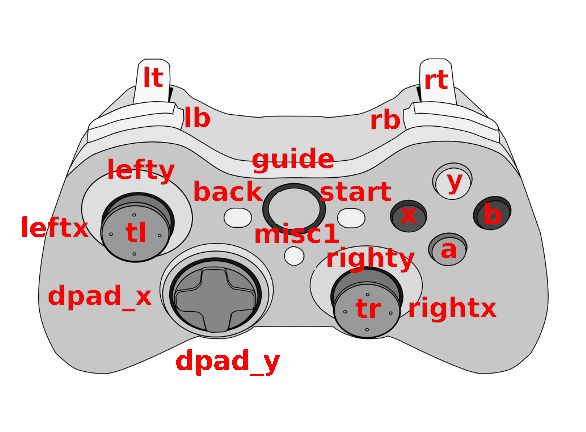

# Overview
SDLXboxMap is command line tool to prepare specific gamepad xboxdrv configuration file from the generic template. Normally the xboxdrv requires assignment button definition to the device specif key event names (e.g.: `ABS_X`, `ABS_Y`, `BTN_WEST`, ...). 

The idea of this tool is to create template with generic names and based on the type of connected gamed the specific configuration will be created. For this purposed SDL gamepad database is used.

# Usage
Look into the folder `examples`. The generic configuration is stored in the configuration files with extension `.tpl`. 
There is even possible to define  configuration for specific gamepads. In some directory (see: `examples\guid_db`) put  configuration file where the base name is gamepad guid id and the extension is `.tpl`.

The gamepad guid is SDL gamepad guid id. The get guid of your gamepad execute program with parameter `-l`

**Example:**

````
$ ./sdlxboxmap -l
030000005e0400008e02000010010000	Microsoft X-Box 360 pad	/dev/input/by-path/pci-0000:00:14.0-usb-0:2:1.0-event-joystick
````

The specifc gamepad configuration is created with the command:

````
$ ./sdlxboxmap -t OpenXCom/OpenXCom.tpl -d OpenXCom/guid_db -o xboxdrv.conf
````

Primary the configuration from `OpenXCom/guid_db` is used. When gamepad definition is not found, default template is used.

# List of mapping commands
The map commands are closed in angle brackets written by capital letters.

- <MAP_ABS:*button_name*> - map *button_name* to the event axis name. If button event does not represent axis, the definition in the  output generated configuration will be commented out and thus not used by `xboxdrv`.

- <MAP_BUTTON:*button_name*> - map *button_name* to the event axis name. Similar as MAP_ABS if the event represent axis. The line with mapping command will be commented out if result event represents axis and not button `xboxdrv`.

- <AXISMAP:[-]*button_name*> Update axis_mapping inversion in front of axis name can be sign `-`.

## Button names
Button names are case insensitive, as button or axis name can be used XboxDrv name or SDL "Generic button name".



| XboxDrv name | Generic button name        | Description                     |
| ------------ | -------------------------- | ------------------------------- |
| a            | a                          | face button                     |
| b            | b                          | face button                     |
| x            | x                          | face button                     |
| y            | y                          | face button                     |
| back         | back                       | back button                     |
| start        | start                      | start button                    |
| guide        | guide                      | big X-button in the middle      |
| du(up)       | du, duup, dpad_y, dpup     | dpad UP direction               |
| dd(own)      | dd, ddown, dpdown          | dpad DOWN direction             |
| dl(left)     | dl, dlleft, dpad_x, dpleft | dpad left direction             |
| dr(right)    | dr, drright, dpright       | dpad right direction            |
| lb           | lb, leftshoulder           | left shoulder button            |
| rb           | rb, rightshoulder          | right shoulder buttons          |
| lt           | lt, lefttrigger            | left analog trigger             |
| rt           | rt, righttrigger           | right analog trigger            |
| tl           | tl, leftstick              | pressing the left analog stick  |
| tr           | tr, rightstick             | pressing the right analog stick |
| x1           | x1, leftx                  | left analog stick x-axis        |
| y1           | y1, lefty                  | left analog stick y-axis        |
| x2           | x2, rightx                 | right analog stick x-axis       |
| y2           | y2, righty                 | right analog stick y-axis       |
| -            | misc1                      | additinal button used by SDL    |
| -            | paddle1                    | additinal button used by SDL    |
| -            | paddle2                    | additinal button used by SDL    |
| -            | paddle3                    | additinal button used by SDL    |
| -            | paddle4                    | additinal button used by SDL    |


The `misc1` button and `paddleX` buttons are not known by XboxDrv, but still can be mapped with `MAP_BUTTON` to some existing XboxDrv button name.

## The custom gamepad defition
The custom gamepad mapping can be added by `SDL_GAMECONTROLLERCONFIG` environment variable

Example:

````
export SDL_GAMECONTROLLERCONFIG="030000005e0400008e02000010010000,Xbox 360 Controller,platform:Linux,a:h0.4,b:h0.2,x:h0.8,y:h0.1,leftstick:b9,rightstick:b10,leftx:a0,lefty:a1,rightx:a3,righty:a4,
050000007e0500000920000001800000,Nintendo Switch Pro Controller,platform:Linux,a:b0,b:b1,x:b3,y:b2,back:b9,guide:b11,start:b10,leftstick:b12,rightstick:b13,leftshoulder:b5,rightshoulder:b6,dpup:h0.1,dpdown:h0.4,dpleft:h0.8,dpright:h0.2,leftx:a0,lefty:a1,rightx:a2,righty:a3,lefttrigger:b7,righttrigger:b8,
030000007e0500000920000011810000,Nintendo Switch Pro Controller,platform:Linux,a:b0,b:b1,x:b3,y:b2,back:b9,guide:b11,start:b10,leftstick:b12,rightstick:b13,leftshoulder:b5,rightshoulder:b6,dpup:h0.1,dpdown:h0.4,dpleft:h0.8,dpright:h0.2,leftx:a0,lefty:a1,rightx:a2,righty:a3,lefttrigger:b7,righttrigger:b8,
060000007e0500000620000000000000,Nintendo Switch Combined Joy-Cons,platform:Linux,a:b0,b:b1,x:b3,y:b2,back:b9,guide:b11,start:b10,leftstick:b12,rightstick:b13,leftshoulder:b5,rightshoulder:b6,dpup:b14,dpdown:b15,dpleft:b16,dpright:b17,leftx:a0,lefty:a1,rightx:a2,righty:a3,lefttrigger:b7,righttrigger:b8,
"
````


# Compile
Install dependency: libevdev

````
sudo apt install libevdev-dev
````
Compile by commands:

````
mkdir build
cd build
cmake ..
make
````